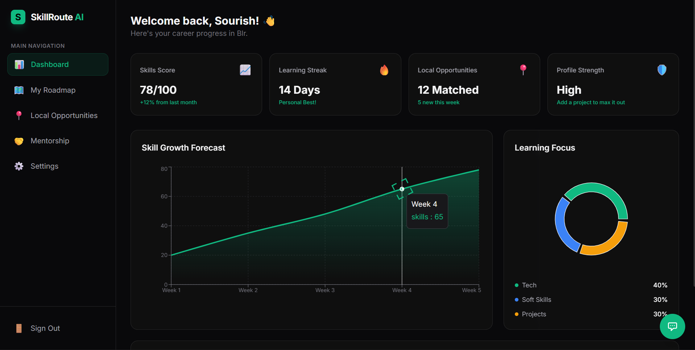

# SkillRoute AI 🚀
> **AI-Powered Career Guidance for Local Success**


## 📖 Overview
**SkillRoute AI** is a GenAI-powered platform designed to empower students, especially in Tier 2/3 cities, to navigate their career paths effectively. Unlike generic platforms, SkillRoute focuses on **hyper-local opportunities**, personalized learning roadmaps, and connecting students with mentors in their own communities.

Whether you are looking for your first freelance gig, a local internship, or just need a roadmap to master a new skill, SkillRoute AI guides you every step of the way.

---

## ✨ Key Features

### 🗺️ AI Roadmap Builder
- Generates personalized, week-by-week learning paths based on your current skills and goals.
- adaptively adjusts to your learning speed and preferences.

### 💼 Local Opportunities
- Discovers and curates relevant internships, NGO roles, freelance gigs, and small business projects in your specific location.
- **Smart Details**: AI-generated requirements, stipends, and duration for every listing.
- **One-Click Apply**: Seamless application process with automated profile summaries.

### 👥 Mentorship Connect
- Matches you with local mentors (freelancers, business owners, professors) who understand your local market context.
- Provides AI-driven conversation starters and advice.

### 🤖 24/7 AI Career Assistant
- An intelligent chatbot that answers your career queries instantly.
- **Offline Mode**: Smart fallback system ensures you get help even when the AI service is busy or offline.
- Context-aware responses that know your profile and goals.

### 🌍 Inclusive Design
- **Multi-language Support**: Accessible in local languages.
- **Minimalist UI**: distraction-free interface optimized for all devices.

---

## 📸 Screenshots

### **Interactive Dashboard**
The command center for your career journey. Track progress, view metrics, and access all tools.



---

## 🛠️ Tech Stack

- **Frontend**: React, Vite, TailwindCSS, Framer Motion
- **Backend**: Node.js, Express.js, MongoDB
- **AI Engine**: Google Gemini API (Pro & Flash Models)
- **State Management**: React Hooks & Context
- **Routing**: React Router v6

---

## 🚀 Getting Started

Follow these steps to set up the project locally.

### Prerequisites
- Node.js (v16+)
- MongoDB (Local or Atlas)
- Google Gemini API Key

### Installation

1. **Clone the repository**
   ```bash
   git clone https://github.com/Sourish-19/SkillRoute-AI.git
   cd SkillRoute-AI
   ```

2. **Install dependencies**
   ```bash
   npm install
   cd server
   npm install
   ```

3. **Configure Environment**
   Create a `.env` file in the `server/` directory:
   ```env
   PORT=5000
   MONGO_URI=your_mongodb_connection_string
   API_KEY=your_gemini_api_key
   JWT_SECRET=your_secret_key
   ```

4. **Run the Application**
   Open two terminals:

   *Terminal 1 (Backend):*
   ```bash
   cd server
   npm start
   ```

   *Terminal 2 (Frontend):*
   ```bash
   npm run dev
   ```

5. **Open in Browser**
   Visit `http://localhost:5173` to start your journey!

---

## 🤝 Contributing
Contributions are welcome! Please feel free to submit a Pull Request.

---

## 📄 License
This project is licensed under the MIT License.
